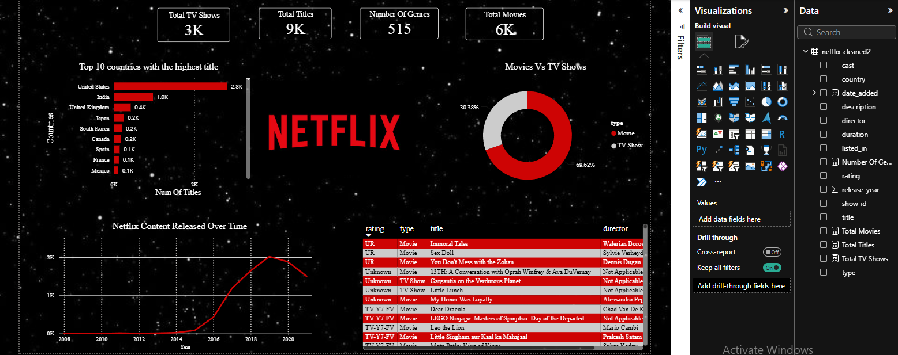

Netflix Analysis Project

Overview

This project explores the Netflix Movies and TV Shows dataset using Python, PostgreSQL, and Power BI. The goal was to clean the data, perform SQL analysis, explore trends with Python, and build an interactive dashboard in Power BI.

⸻

Tools Used

* Python
    * Pandas
    * Matplotlib
    * Seaborn
* PostgreSQL
* Power BI
* Visual Studio Code
* Git & GitHub

⸻

Project Workflow

1. Data Cleaning (Python)

* Loaded the dataset with Pandas
* Investigated missing values
* Replaced missing values where appropriate with “Not Applicable”
* Saved a cleaned dataset for further analysis

2. SQL Analysis (PostgreSQL)

Some of the questions answered include:

* Which country has the most Netflix titles?
* How many Movies and TV Shows are available?
* Which ratings appear most frequently?
* Which release years have the most titles?
* Other exploratory SQL queries using GROUP BY, ORDER BY, COUNT, and filtering.

3. Python Analysis

Performed exploratory data analysis and created visualizations such as:

* Top actors appearing on Netflix
* Genre analysis
* Country analysis
* Additional charts using Seaborn

4. Power BI Dashboard

Created an interactive dashboard containing:

* Total Movies KPI
* Total TV Shows KPI
* Total Titles KPI
* Number of Genres KPI
* Top 10 Countries by Number of Titles
* Movies vs TV Shows Distribution
* Netflix Content Released Over Time
* Content Details Table

⸻

Dashboard Preview

⸻

Skills Demonstrated

* Data Cleaning
* Exploratory Data Analysis
* SQL Querying
* Data Visualization
* Dashboard Design
* Git & GitHub
* Data Storytelling

⸻

Dataset

Netflix Movies and TV Shows Dataset

⸻

Author

Chloe Osakwe
Aspiring Data Engineer | Ai Engineer | Machine Learning Engineer